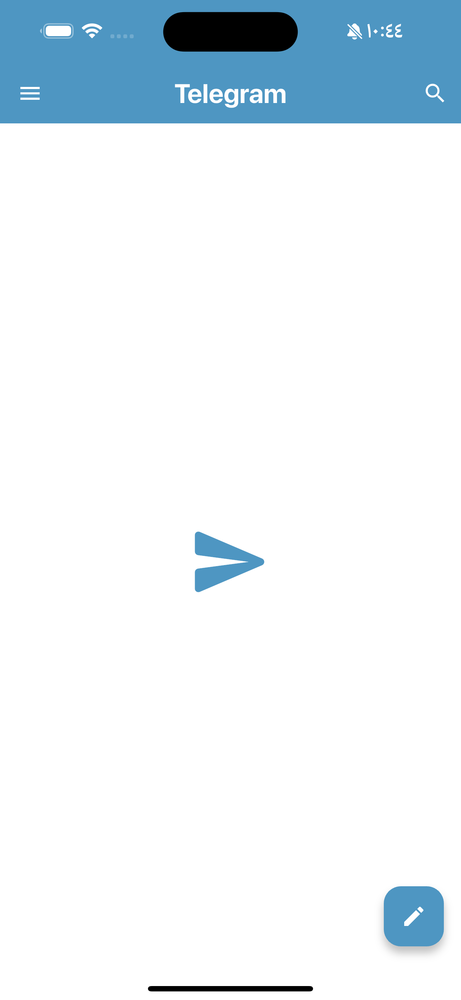
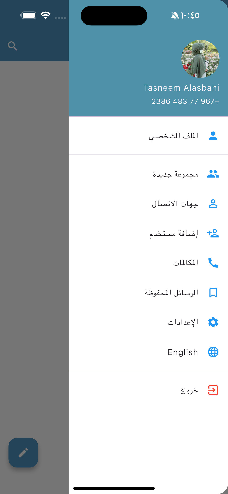
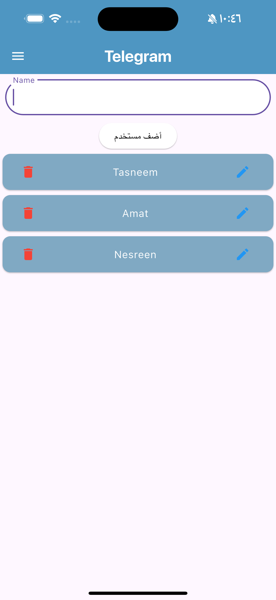
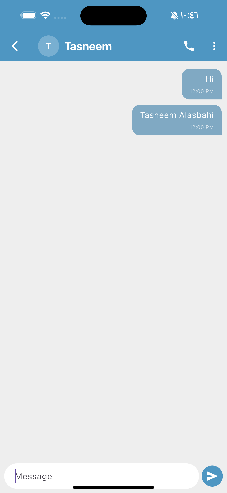
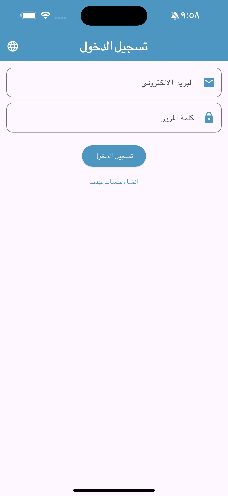

# Telegram Clone 📱

A Flutter application that simulates the Telegram interface, focusing on State Management, Localization, and Data Persistence.

## Features ✨
* **State Management:** Powered by `GetX` for efficient and reactive performance.
* **Localization:** Supports both **Arabic** and **English** (LTR/RTL support) including the Drawer.
* **Data Persistence:** Uses `GetStorage` to save user data locally.
* **Custom UI:** Beautiful blue theme with a custom Splash Screen.

## App Screenshots 📸

| Home (Arabic) | Home (English) | Side Drawer |
| :---: | :---: | :---: |
|  |  |  |

| Add User | Chat Screen | Login Screen |
| :---: | :---: | :---: |
|  |  |  |

## Tech Stack 🛠️
* Flutter SDK
* GetX (State, Navigation, Localization)
* GetStorage (Local Storage)

---
Developed by: **Tasneem Alasbahi**